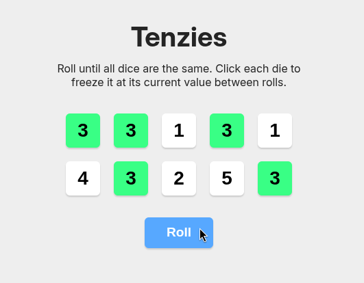

## Tenzies

Tenzies is a web app based on the dice game Tenzi where you have dice and roll them until you get all the dice to the same number

This project was created with React, JavaScript and CSS3

### Features

- Display 10 random dice
- Hold dice by clicking on them
- Display random dice on "roll" button click without changing dice held
- Once all dice have the same number, show confetti and change "roll" button to "game won"
- Start a new game by pressing "game won" button

### Image

### Note

This project was assigned by Scrimba on the React course
